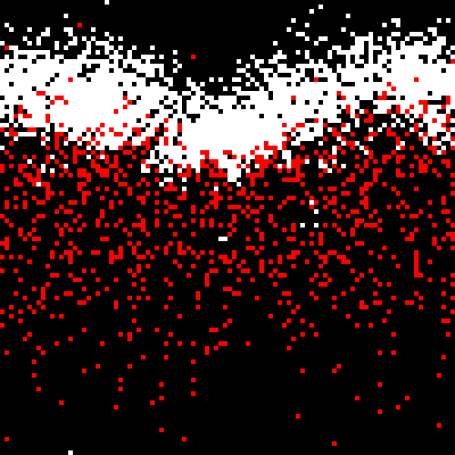
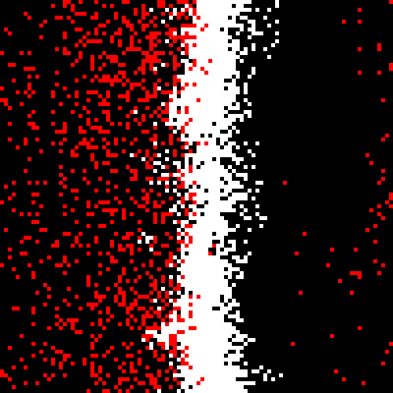
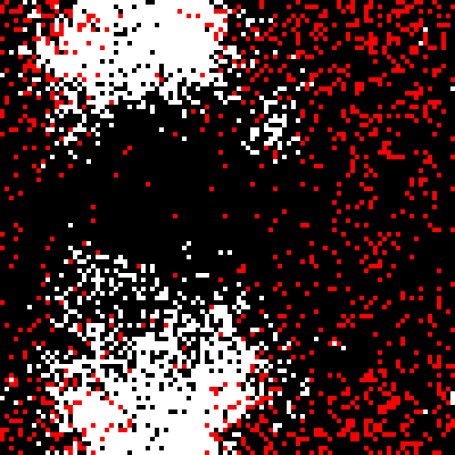

Ecosystem Simulator
===================

This is a simulation of population dynamics.

Example
-------

The simulation accepts several parameters:

    $ ./ecosystem <width> <height> <rabbits> <rabbits_max> <foxes> <foxes_max> <simulation_length>
    

For example,

    $ ./ecosystem 100 100 1000 5000 1000 2000 0

With those parameters, the simulation settles into one of several (meta-)stable states after a few thousand time
steps. A few of these states are shown below. Note that the lattice is toroidal (i.e., it wraps around the edge to the
other side).

The population of foxes (red dots) can be seen to be chasing the population of rabbits (white dots).

