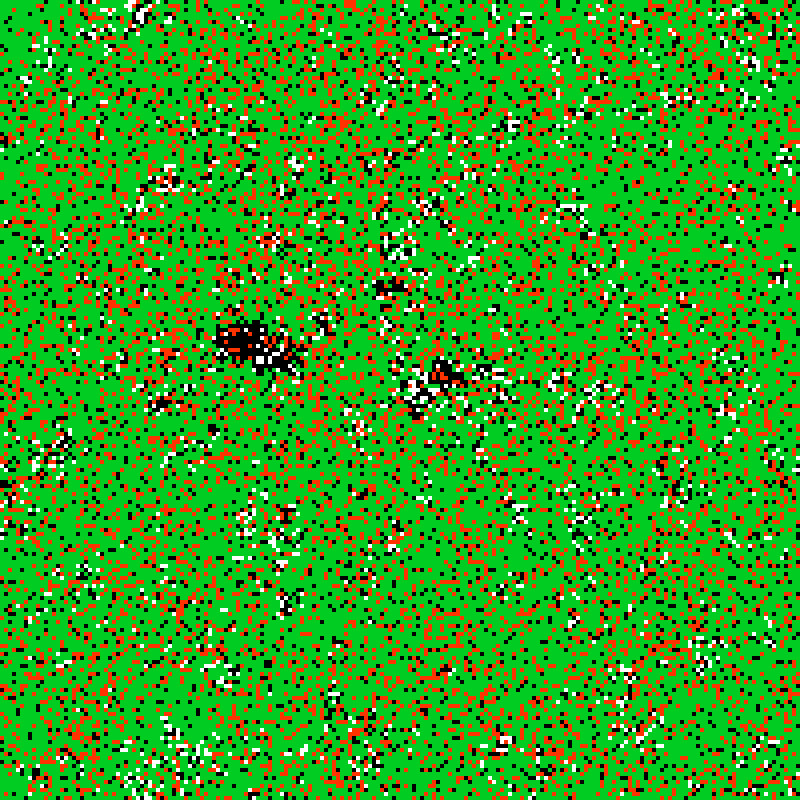
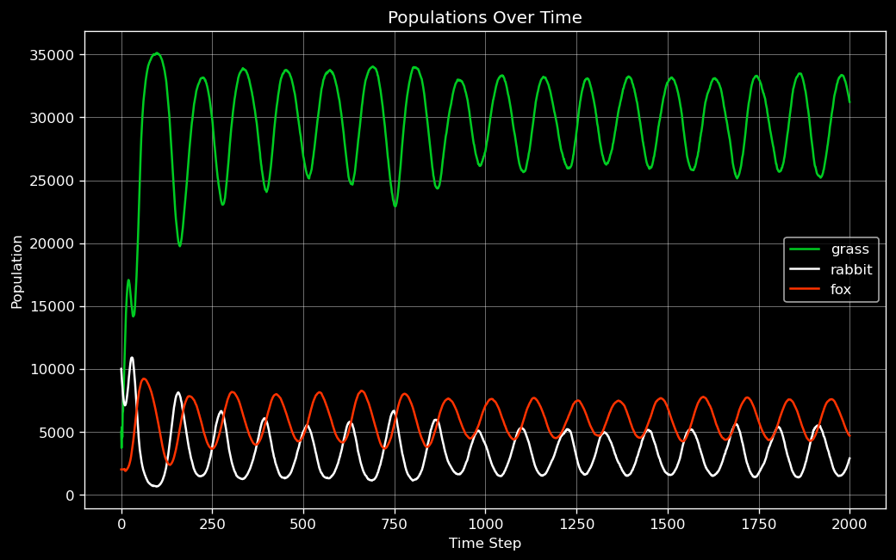
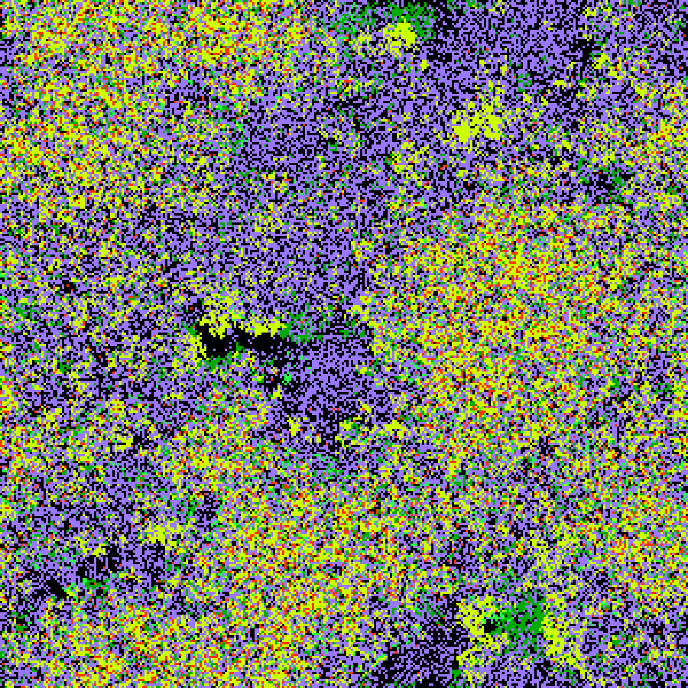
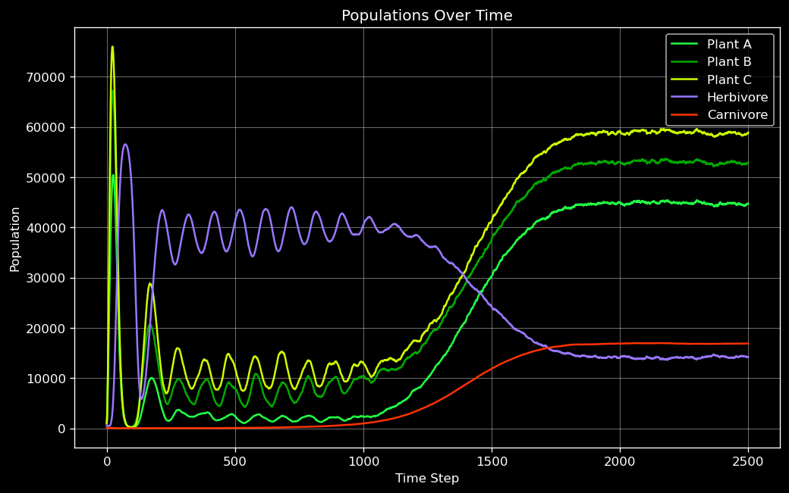
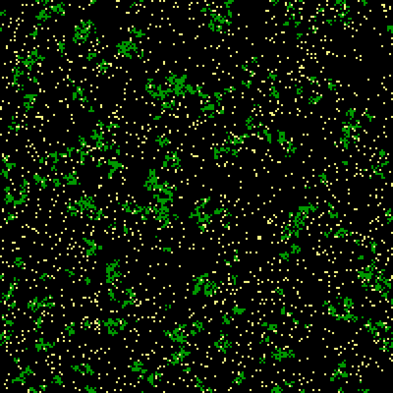
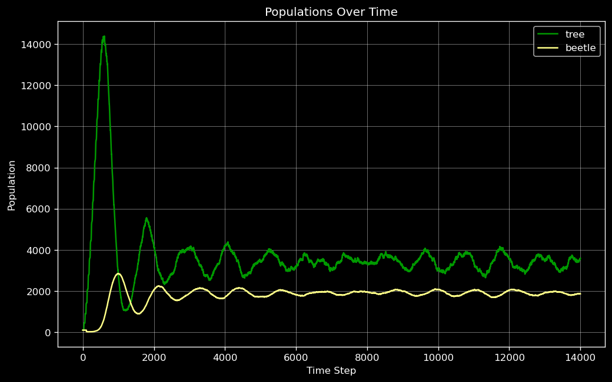

Ecosystem Simulator
===================

This is a simple simulation of population dynamics.

Usage and Examples
------------------

The simulation accepts a JSON-based configuration file as a command-line argument. The configuration file describes how
each population behaves. See the [example configuration files](config/).

To run:

    $ ./ecosystem <config_file.json>

Here is a simulation of [grass, rabbits, and foxes](config/grass_rabbit_fox.json):

Here is a simulation of [an ecosystem with five organisms](config/balance.json):

Here is a simulation of [trees and beetles](config/tree_beetle.json):

